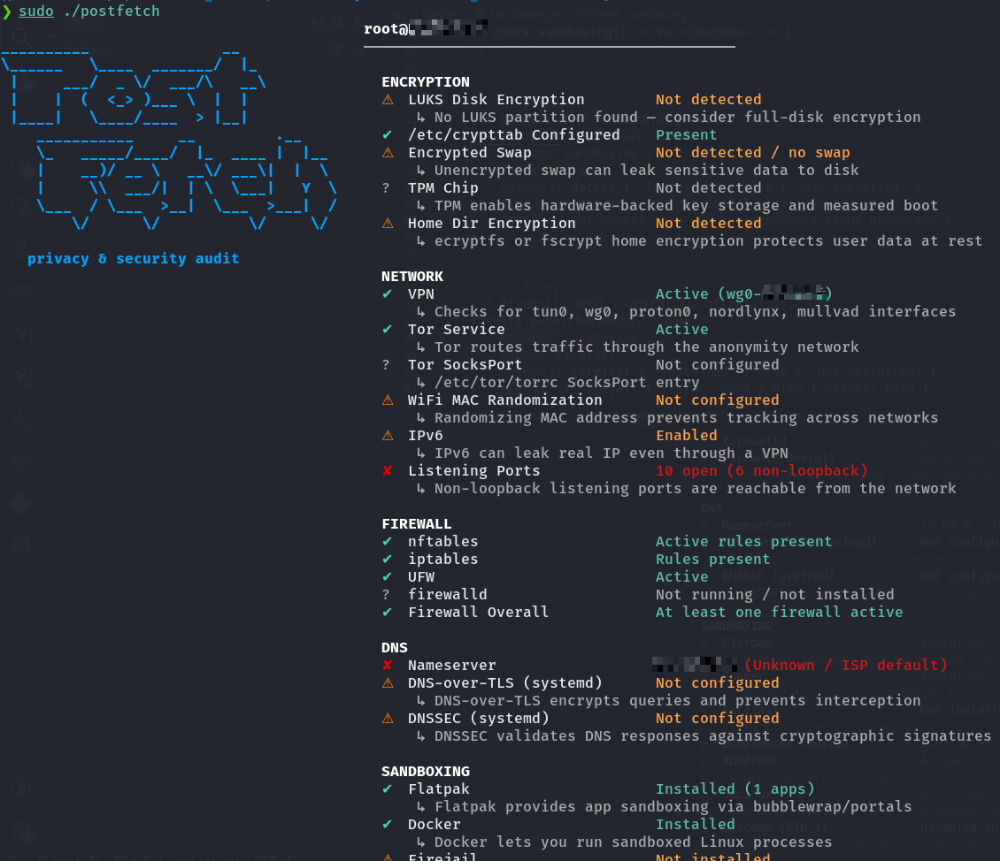

# postfetch  

[](https://github.com/R3DRUN3/postfetch/actions/workflows/release.yml)
  
[](http://unlicense.org/)
[](https://github.com/r3drun3/postfetch/releases/latest)


<p align="left">
  
</p>

A fastfetch-style **privacy and security audit tool** for Linux, written in rust.  

Instead of cosmetic system info, `postfetch` shows whether your system
is configured to support **privacy, security, local control, and digital sovereignty**.

## Modules

| Module       | Checks                                                                                                          |
|--------------|-----------------------------------------------------------------------------------------------------------------|
| encryption   | LUKS disk encryption, dm-crypt active devices, /etc/crypttab, encrypted swap, TPM chip, home dir encryption    |
| firewall     | nftables, iptables, UFW, firewalld, overall firewall status                                                     |
| dns          | Nameservers + provider label, DNS leak risk, DNS-over-TLS, DNSSEC, local resolvers (unbound, dnsmasq, dnscrypt)|
| telemetry    | apport, whoopsie, snapd, geoclue, avahi, systemd-coredump, Firefox telemetry prefs, Chrome managed policies    |
| sandboxing   | Flatpak, Firejail, bubblewrap, AppArmor, SELinux, seccomp (PID 1), Docker                                      |
| hardening    | ASLR, kptr_restrict, dmesg_restrict, perf_event_paranoid, ptrace_scope, unprivileged user namespaces,          |
|              | core dumps, TCP SYN cookies, RP filter, ICMP redirects, IP forwarding, NX/XD bit, Secure Boot, USBGuard, auditd|
| network      | VPN interface (tun/wg/proton/mullvad), Tor service + SocksPort, WiFi MAC randomization, IPv6 status, open ports|


## Quick start

The following one-liner let's you run the latest binary directly:  

```bash
curl -sL https://github.com/R3DRUN3/postfetch/releases/download/v0.1.0/postfetch-v0.1.0-x86_64-linux-musl.tar.gz | tar -xz && ./postfetch
```  

Note: In order to cover all the checks, better to run as `sudo`:  

  


If you want to reduce the output, you can also run a single module, for example:  
```bash
sudo ./postfetch --module network
```  

## Options

```
-w, --warnings-only     Only show non-passing checks
    --no-color          Disable ANSI color output
-m, --module <MODULE>   Run a single module only
```

## Adding a new module

1. Create `src/checks/mymodule.rs` —> implement `pub fn check_mymodule() -> Vec<CheckResult>`.
2. Declare it in `src/checks/mod.rs` with `pub mod mymodule;`.
3. Add a match arm in `src/main.rs`.

That's it, no other changes needed.
